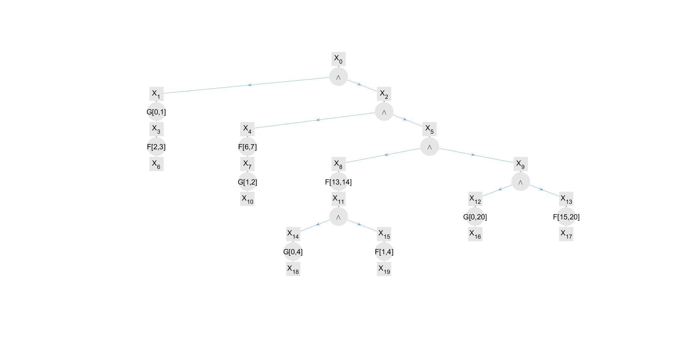

# sTLT toolkit
This is the accompanying code for the paper *Continuous-time control synthesis under nested signal temporal logic specifications*  by Pian Yu, Xiao Tan, and Dimos V. Dimarogonas. This code automatically constructs the sTLT tree structure and calculate the set nodes, start time intervals, etc. It also provides automatic synthesis of corresponding CBFs from a given sTLT. 

# How to run
You need to install [helperOC](https://github.com/HJReachability/helperOC) for the HJB reachability analysis in the unicycle case. After that, add `\utility_func` and `\src` to Matlab path.

To reproduce Fig. 3 and Fig. 5 in the paper, run `main_singleIntegrator.m`. To reproduce Fig. 4 and Fig.6, run `main_unicycle.m`. It can take a while for the reachability computations. Try different initial conditions, input bounds, STL formulas, regions of interest, etc.

If you are interested in some submodule of the overall algorithm, try to run 
 - `unitTest_stl2sTLT_XX.m` for converting a given STL formula to an sTLT tree
 - `unitTest_sTLTObj_XX.m` for experimenting `sTLTObj`
 - `unitTest_stlt2cbf_XX.m` for constructing CBFs from a given sTLT
 - `unitTest_simulator.m` for online simulation and plotting
 - `tutorial_uni_ReachabilityOperation_RM_Rm.m` for HJB-based reachability analysis 
 

# Matlab objects
We have defined several Matlab objects in this repo, including
 - `STLformula` for STL formulas
 - `sTLTObj`, `setNodeObj`,`operatorNodeObj` for sTLT-related constructions;
 - `singleIntegratorCBF`,`unicycleCBF` for CBF-related constructions

Currently only dynamical systems of type `singleIntegrator` or `unicycle` are implemented, but it should be adaptable to other dynamics following the example code. 

# If you want to go deeper
## sTLT structure
A sTLT tree is simply constructed from a list of node objects and their parentage relations.

`tree = sTLTObj(nodeList,parentList);`

`sTLTObj` is a Matlab handle class. You can view the tree structure with `tree.draw_sTLT();`.

## CBF synthesis
For single integrator dynamics, only circular regions are considered as regions of interest. 

`obj = singleIntegratorCBF(timeInterval,c,r,vMax,obs)`

The `obs` flag is needed only if the circular region is an obstacle. `timeInterval ` is  $$[\underline{t}_{\mathfrak{b}_i}, \bar{t}_s(\mathbb{X}_{f_i}), \bar{t}_{\mathfrak{{b}_i}}]$$ for a temporal fragment. `c` and `r` are the center and radius of the circular region, and `vMax` is the velocity bound. 

For unicycle models, the procedure is to first construct the set (represented by a grid and a super-level set from the data). This step is done by conducting the reachability analysis. Then

 `uniCBF = unicycleCBF(timeInterval,grid,data0,vRange,wMax)`
 
More details on the `uniCBF` and reachability analysis are given in two tutorials `tutorial_unicyleObj.m` and `tutorial_uni_ReachableOperation_RM_Rm.m`.

# Miscellaneous
- A brief introduction to the reachability toolbox [helperOC](https://github.com/HJReachability/helperOC) is in `\docs`

- Several files, including `src\STLparse.m`, are modified from the toolkit [BluSTL](https://github.com/BluSTL/BluSTL) 

